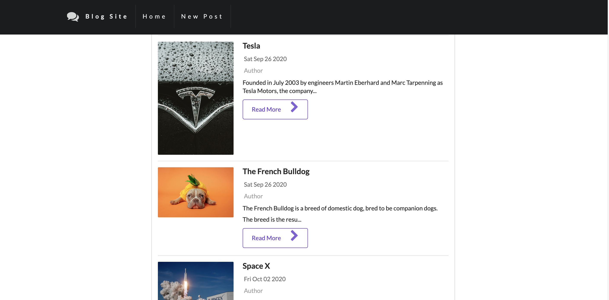
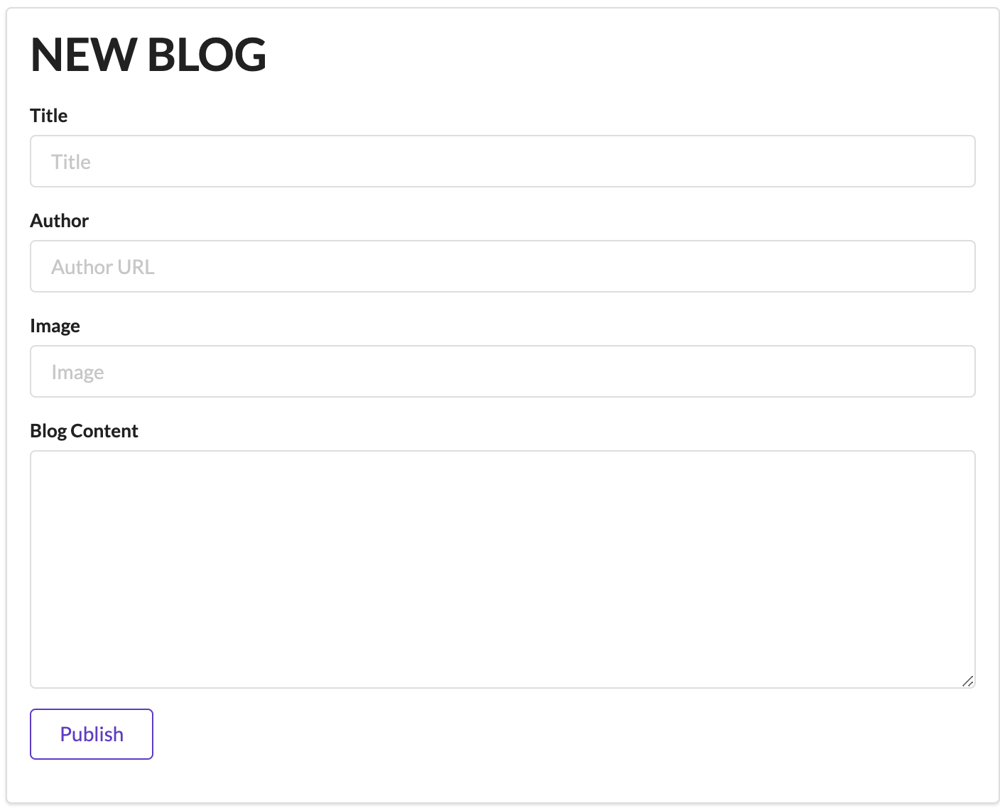
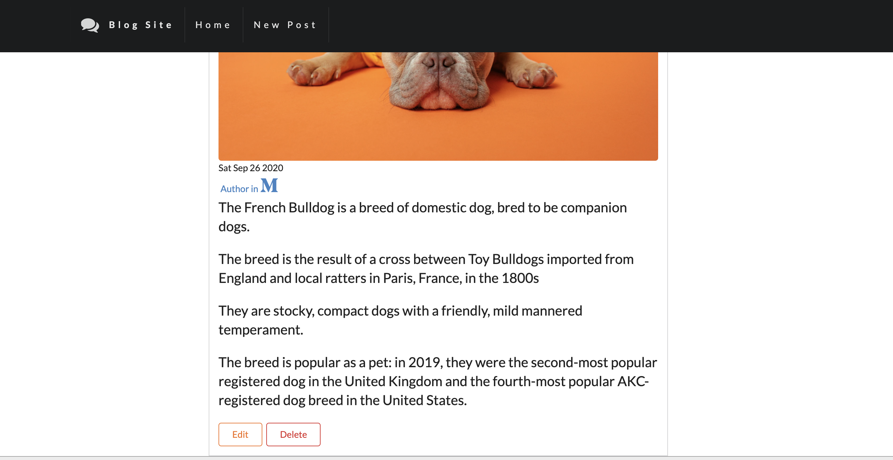

# RESTful Blog Site


*This is a blog site that I created by following Restful API*  

---
## Technologies Used
-Used new library called Semantic UI(User Interface) instead of Bootstrap.
-NodeJS with Express.
-EJS for templating
-Database(MongoDB) using Mongoose
-CSS3


you can visit it [here]("") 

- - -


---
```javascript 
//NEW ROUTE
app.get("/blogs/new", function (req, res) {
    res.render("new");
});
```
---


---
```javascript
//EDIT ROUTE
app.get("/blogs/:id/edit", function (req, res) {
    Blog.findById(req.params.id, function (err, foundSpecificBlog) {
        if (err) {
            res.redirect("/blogs");
        } else {
            res.render('edit', {
                blog: foundSpecificBlog

            });
        }

    });
});

//UPDATE ROUTE
app.put("/blogs/:id", function (req, res) {
    var image = req.body.image;
    var title = req.body.title;
    var body = req.body.body;
    var author = req.body.author;
    var newBlog = {
        title: title,
        image: image,
        body: body,
        authorBy: author
    }
    req.body.body = req.sanitize(req.body.body)
    Blog.findByIdAndUpdate(req.params.id, newBlog, function (err, updatedSpecificBlog) {
        if (err) {
            res.redirect("/blogs");
        } else {
            res.redirect("/blogs/" + req.params.id);
        }
    });
});
```

| Name| Email |
|---------|-------|
|Halil Sekeroglu |  halil.sekerogluu@gmail.com |


